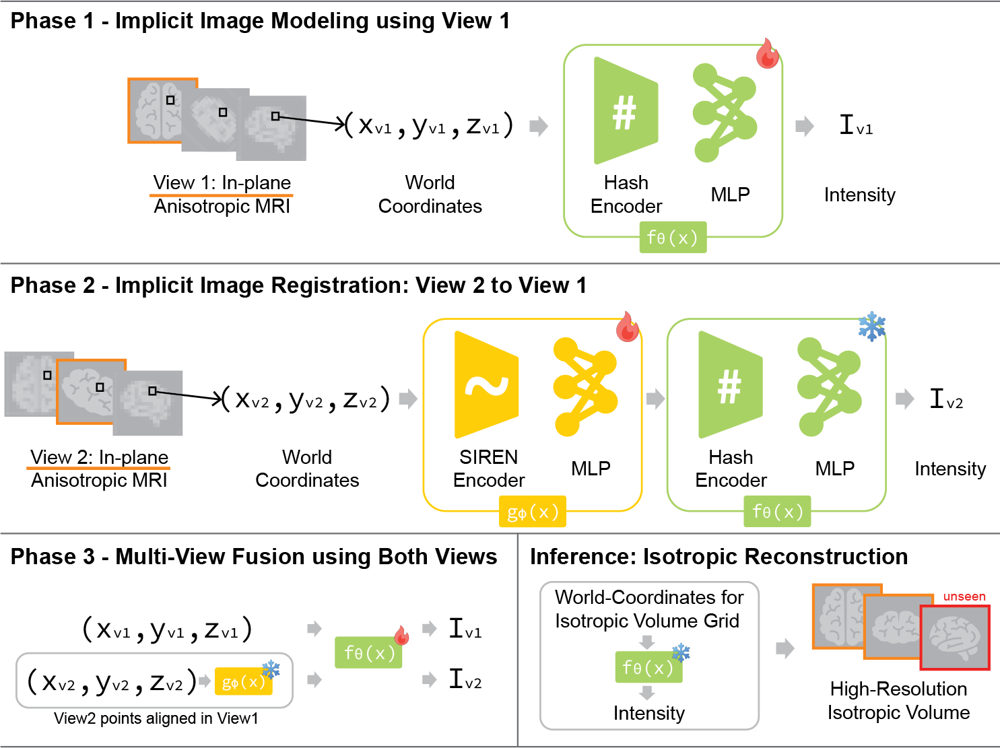
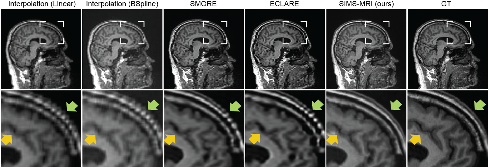

# Single-Subject Multi-View MRI Super-Resolution via Implicit Neural Representations

This repository contains code for the SIMS-MRI pipeline described in the paper
_Single-Subject Multi-View MRI Super-Resolution via Implicit Neural
Representations_.

## Method Overview



We propose a three-stage single-subject pipeline:

1. Phase 1 fits an implicit image model to one anisotropic input view.
2. Phase 2 learns inter-view alignment.
3. Phase 3 refines the final reconstruction using both image and registration
   checkpoints.

Phase 1 and Phase 3 use FreeNeRF-style progressive hash unlock by default.



*Qualitative comparison of unseen-view brain MRI reconstruction across methods.*

## Implementation Overview

Training is split into three phases:

- `sims-mri-train-phase1` for image generation
- `sims-mri-train-phase2` for registration
- `sims-mri-train-phase3` for mixed training

The checked-in example configs are under `configs/` (e.g. `configs/oasis_ngp_rigid.yaml`). The default configs expect data under `./oasis_random`, cache processed tensors under `preprocessed_data/`, and write experiment outputs under `runs/` plus optional MLflow runs under `mlruns/`.

## Setup

### Prerequisites

- Python 3.10
- NVIDIA GPU with a CUDA 12.1-compatible driver recommended
- `uv` or `conda`

The training scripts prefer `cuda`, then `mps`, then `cpu`.

### With uv

We intentionally exclude the PyTorch stack from `requirements.txt` so you can install the CUDA build that matches your setup first.

```bash
uv venv --python 3.10
source .venv/bin/activate

# Install the CUDA-enabled PyTorch build first.
uv pip install --index-url https://download.pytorch.org/whl/cu121 torch torchvision

# Install the package in editable mode (also installs remaining dependencies).
uv pip install -e .
```

### With conda

```bash
conda env create -f environment.yml
conda activate sims-mri
python -c "import torch; print({'torch': torch.__version__, 'cuda': torch.version.cuda, 'cuda_available': torch.cuda.is_available()})"
```

### Clone upstream dependencies

```bash
bash scripts/setup_upstreams.sh
```

This clones [IDIR](https://github.com/MIAGroupUT/IDIR) and [multi_contrast_inr](https://github.com/jqmcginnis/multi_contrast_inr) into the project root.

## OASIS-3 Dataset Setup

The brain experiments use the [OASIS-3](https://www.oasis-brains.org/) dataset. It can be accessed here: https://www.oasis-brains.org/.

### 1. Download and organize the raw data

After obtaining access, download the T1-weighted MRI scans and arrange them in a BIDS-style directory:

```text
OASIS-3-BIDS-selected/
  selected_participants_brain.tsv
  sub-OAS30001/
    ses-M006/
      anat/
        sub-OAS30001_ses-M006_run-01_T1w.nii.gz
  sub-OAS30433/
    ses-M066/
      anat/
        sub-OAS30433_ses-M066_run-02_T1w.nii.gz
  ...
```

The TSV file drives preprocessing. It must have two columns:

| participant_id | selected_scan |
|---|---|
| sub-OAS30001_ses-M006_run-01_T1w | sub-OAS30001/ses-M006/anat/sub-OAS30001_ses-M006_run-01_T1w.nii.gz |
| sub-OAS30433_ses-M066_run-02_T1w | sub-OAS30433/ses-M066/anat/sub-OAS30433_ses-M066_run-02_T1w.nii.gz |

- `participant_id` — subject identifier used for output directory naming
- `selected_scan` — path to the NIfTI file relative to the dataset root

### 2. Run the preprocessing script

```bash
uv run python scripts/preprocessing_brain.py \
  --dataset-root OASIS-3-BIDS-selected \
  --output-root oasis_random
```

For each subject this produces axial/coronal low-resolution views, a zero-padded 256^3 volume, and translated/rotated/rigid transform variants under the output root.

### 3. Point the config at your preprocessed data

The `oasis_ngp_rigid.yaml` config expects the preprocessing output:

```yaml
SETTINGS:
  DIRECTORY: "./oasis_random"
DATASET:
  SUBJECT_ID: "sub-OAS30433_ses-M066_run-02_T1w"
```

Update `SUBJECT_ID` to match the subject you want to train on. The loader combines `DIRECTORY`, `SUBJECT_ID`, and the `LR_CONTRAST` suffixes to locate input files.

## Typical Workflow

Run the three stages in order, passing the previous stage checkpoints forward:

```bash
# Phase 1
sims-mri-train-phase1 --config configs/oasis_ngp_rigid.yaml

# Phase 2
sims-mri-train-phase2 \
  --config configs/oasis_ngp_rigid.yaml \
  --phase1_checkpoint runs/<phase1_id>/<weight_subdir>/<checkpoint>_model.pt

# Phase 3
sims-mri-train-phase3 \
  --config configs/oasis_ngp_rigid.yaml \
  --phase1_checkpoint runs/<phase1_id>/<weight_subdir>/<checkpoint>_model.pt \
  --phase2_checkpoint runs/<phase2_id>/<weight_subdir>/<checkpoint>_model_rotation.pt
```

The exact checkpoint paths depend on your run settings and early-stopping
behavior. Each phase writes its artifacts under `runs/<unique_id>/` with
a descriptive subdirectory (e.g. `hash_L16_F32_cat_<project>_w_es/`).

The default config enables FreeNeRF-style progressive hash unlock for Phase 1 and Phase 3. To disable it, set `PROGRESSIVE_HASH_UNLOCK: False` in your config under `GENERATION_MODEL`.

You can also run the modules directly:

```bash
uv run python -m sims_mri.training.phase1_generation --help
```

## Citation

If you use SIMS-MRI in your work, please cite the following paper:

```bibtex
@misc{kim2026singlesubjectmultiviewmrisuperresolution,
      title={Single-Subject Multi-View MRI Super-Resolution via Implicit Neural Representations},
      author={Heejong Kim and Abhishek Thanki and Roel van Herten and Daniel Margolis and Mert R Sabuncu},
      year={2026},
      eprint={2603.22627},
      archivePrefix={arXiv},
      primaryClass={eess.IV},
      url={https://arxiv.org/abs/2603.22627},
}
```